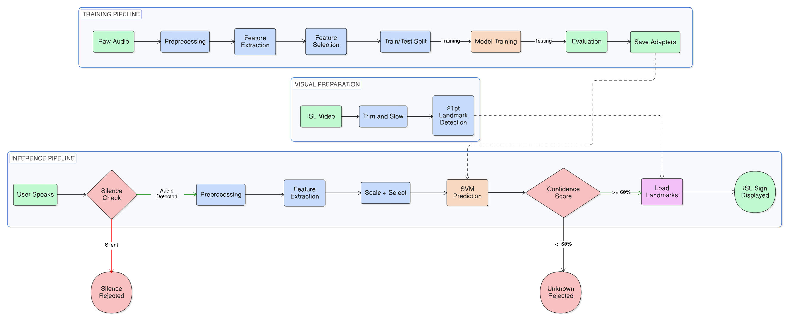
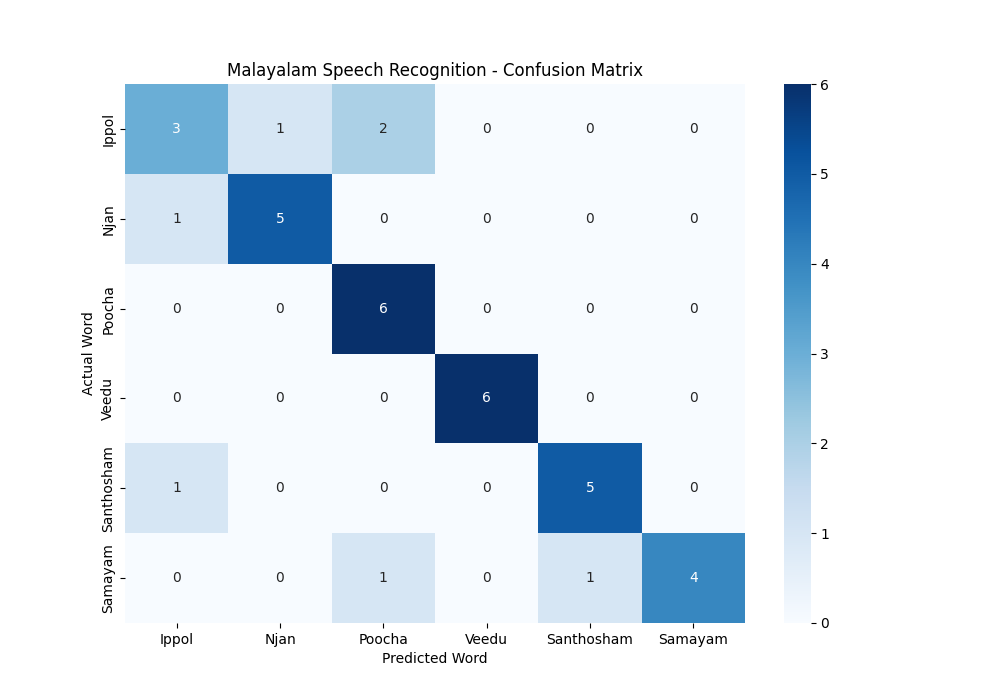
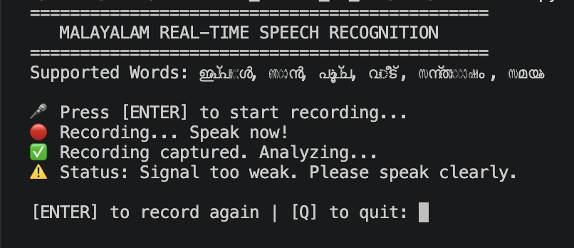
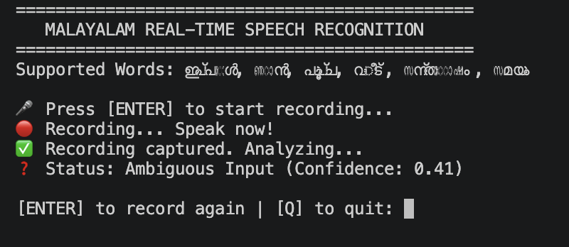
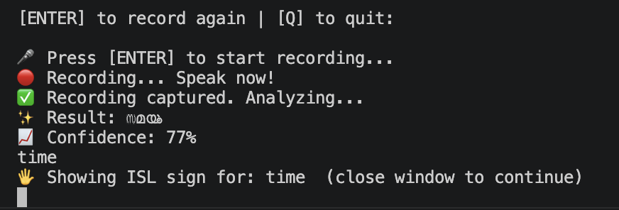
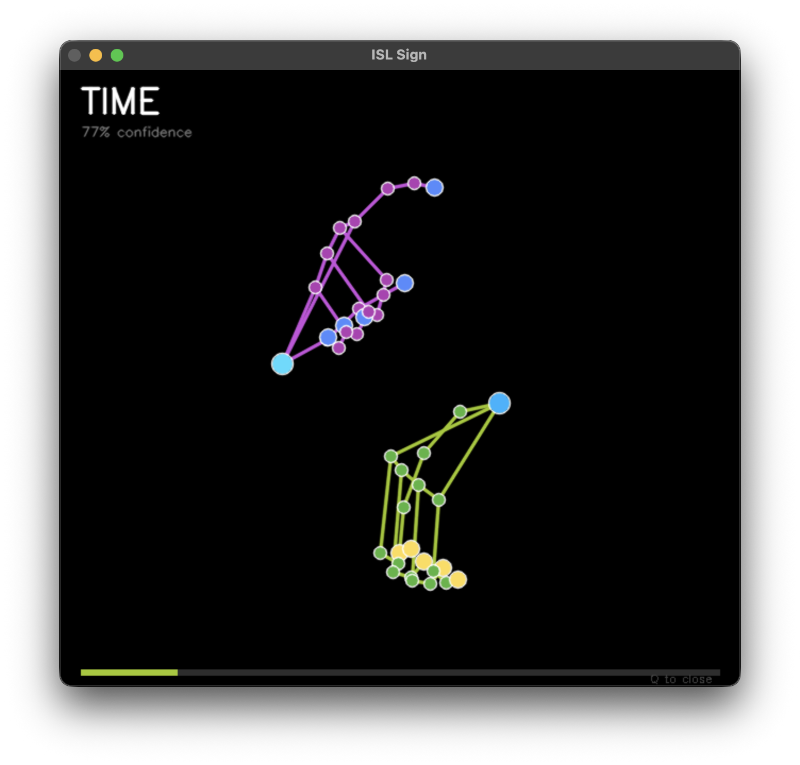

# 🤟 Malayalam Speech → Indian Sign Language (ISL) Generator

> A real-time, speech-driven ISL animation system for Malayalam — bridging the communication gap between the hearing majority and the Deaf and Hard-of-Hearing (DHH) community in Kerala.

---

## 📌 Overview

Existing Speech-to-Sign systems focus almost entirely on English. This project fills a critical gap by building a **Malayalam-first** isolated word recognizer that listens to spoken Malayalam and renders the corresponding ISL hand gesture as a real-time skeletal animation.

Given the constrained dataset (6 target words, 30 samples each), we took a deliberate **classical ML approach** — pairing a Support Vector Machine (SVM) with MediaPipe-based 2D landmark visualization — to avoid the overfitting that Deep Learning would introduce at this scale.

**Team:** Adithyan UM · Akhilesh S · C Aathithya  
**College:** Sree Chitra Thirunal College of Engineering (SCTCE), Thiruvananthapuram  
**Submitted to:** APJ Abdul Kalam Technological University · April 2026

---

## 🎯 Supported Vocabulary (6 Words)

| Malayalam | English |
|-----------|---------|
| ഇപ്പോൾ | Now |
| ഞാൻ | I / Me |
| പൂച്ച | Cat |
| വീട് | House |
| സന്തോഷം | Happy |
| സമയം | Time |

---

## 🛠️ Tech Stack

| Layer | Tools |
|-------|-------|
| Audio Processing | `librosa`, `soundfile`, `numpy` |
| Machine Learning | `scikit-learn` (SVM · StandardScaler · SelectKBest) |
| Sign Visualization | `MediaPipe` (Holistic/Hands landmarks) · `OpenCV` |
| Smoothing | `scipy` (Gaussian filter1d, σ=2.0) |
| Data Augmentation | Custom scripts (pitch shift · time stretch · noise inject) |

---

## 🏗️ System Architecture



---

## ⚙️ Pipeline Walkthrough

**1. Audio Input & Preprocessing** — Records `.wav` input, trims silence using RMS-based VAD (threshold: 20 dB), resamples to 16 kHz mono, applies amplitude normalization, and pads/truncates to exactly 1.0 second.

**2. Feature Extraction** — Extracts a 39-dimensional MFCC matrix (13 static + 13 delta + 13 delta-delta) per frame, resulting in a **1,248-dimensional** flat feature vector capturing spectral shape, velocity, and acceleration of speech.

**3. Dimensionality Reduction** — ANOVA F-test via `SelectKBest` retains only the **top 300** most discriminative features, cutting inference lag from ~200ms → **under 50ms**.

**4. Classification** — SVM with RBF kernel, hyperparameter-tuned via `GridSearchCV` (5-fold CV). Platt Scaling (`probability=True`) enables confidence scores for the gating step.

**5. Confidence Gating** — Predictions below **60% confidence** are rejected as "Unknown", preventing hallucinations on ambient noise or out-of-vocabulary inputs.

**6. ISL Rendering** — Pre-recorded ISL videos (from the official ISL Research & Training Centre dictionary) are processed via MediaPipe Hands to extract 21 3D hand landmark coordinates per frame. Gaussian smoothing (σ=2.0) is applied for temporal stability. OpenCV renders the skeleton at **30 FPS** on a black canvas — gold wrist, cyan fingertips, green knuckles.

---

## 📊 Dataset & Augmentation

| Stage | Count |
|-------|-------|
| Base recordings (6 words × 30 samples) | 180 |
| After augmentation (white noise · pitch shift · speed variation) | **1,800** |

Source: [`ai4Bharat/IndicVoices`](https://huggingface.co/ai4bharat) corpus on HuggingFace — multiple native speakers, realistic acoustic conditions.

---

## 📈 Results

### Classification Report

| Word | Precision | Recall | F1-Score |
|------|-----------|--------|----------|
| ഇപ്പോൾ (Now) | 0.60 | 0.50 | 0.55 |
| ഞാൻ (I/Me) | 0.83 | 0.83 | 0.83 |
| പൂച്ച (Cat) | 0.67 | 1.00 | 0.80 |
| വീട് (House) | **1.00** | **1.00** | **1.00** |
| സന്തോഷം (Happy) | 0.83 | 0.83 | 0.83 |
| സമയം (Time) | **1.00** | 0.67 | 0.80 |
| **Overall Accuracy** | | | **0.81** |
| Macro Average | 0.82 | 0.81 | 0.80 |

### Confusion Matrix



**Key observations:**
- `വീട്` (House) and `പൂച്ച` (Cat) achieved near-perfect separation — acoustically distinct enough that the RBF kernel cleanly separates them in high-dimensional space.
- `ഇപ്പോൾ` (Now) showed the most confusion — its short, abrupt phonetic profile makes it harder to distinguish from transient background noise.
- `സമയം` (Time): perfect precision (1.00) with lower recall (0.67) — when the model does predict it, it's never wrong.

### ANOVA Feature Selection Impact

| | Feature Dimensions | Inference Latency |
|--|--|--|
| Before | 1,248 | ~200ms |
| After ANOVA | **300** | **<50ms** |

Only 24% of extracted audio data was statistically significant for distinguishing the 6 words.

---

## 🖥️ Demo Screenshots

| State | Description |
|-------|-------------|
| 🔇 Silence | RMS energy below threshold → system stays idle, no CPU overhead |
| ❓ Ambiguous | Confidence 41% → rejected, no sign rendered |
| ✅ Recognized | "TIME" detected at 77% confidence → ISL animation launched |


### 🧾 Root Mean Square (RMS) Silence Detection



### ⚡ Confidence Gating for Ambiguous Input



### 🧠 Successful Word Recognition



### 💡 Real-time skeletal rendering of the recognized word 



---

## 💻 Setup & Usage

**Prerequisites:** Python 3.9+, working microphone

```bash
# Clone the repo
git clone https://github.com/adithyanum/malayalam_speech2Sign.git
cd malayalam_speech2Sign

# Create and activate virtual env
python -m venv venv
source venv/bin/activate   # Windows: venv\Scripts\activate

# Install dependencies
pip install -r requirements.txt
```

**Train the model:**
```bash
python src/train_model.py
```

**Run inference:**
```bash
python inference.py
```

**Hardware minimum:** Intel i5 8th Gen / AMD Ryzen 5 / Apple M-series · 8GB RAM · 16 kHz-capable microphone

---

## 🔮 Future Roadmap

- **Continuous Speech Recognition** — Replace isolated-word SVM with Whisper or IndicWav2Vec for full sentence transcription
- **ISL Grammar Translation** — NLP pipeline to convert Malayalam SOV grammar → ISL Gloss order
- **Non-Manual Features** — Integrate MediaPipe Face Mesh for facial expressions and head movements
- **3D Avatar** — Transition from 2D MediaPipe skeleton to a rigged 3D avatar in Unity or Three.js with animation blending
- **Bidirectional** — Add a Sign-to-Speech module (camera → ISL recognition → synthesized Malayalam audio)
- **Mobile / Edge Deployment** — Optimize for Android/iOS or Raspberry Pi as a portable assistive tool

---

## 📄 References

1. Thushara P.V. & Gopakumar C. — *An SVM Based Speaker Independent Isolated Malayalam Word Recognition System*, IJETCAS, 2014
2. Monga H. et al. — *Speech to Indian Sign Language Translator*, IOS Press, 2021
3. Peguda J. et al. — *Speech to Sign Language Translation for Indian Languages*, ICACCS, IEEE, 2022
4. Gupta A. & Sarkar K. — *Recognition of Spoken Bengali Numerals Using MLP, SVM, RF Based Models*, IAJIT, 2018

---

*Built to make communication accessible to all 💝*
